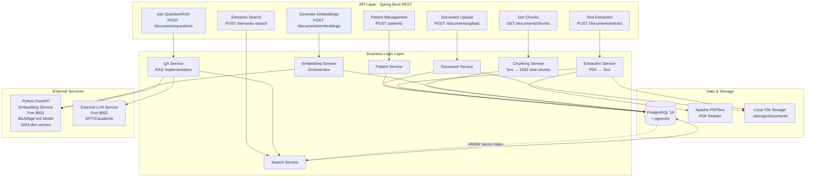
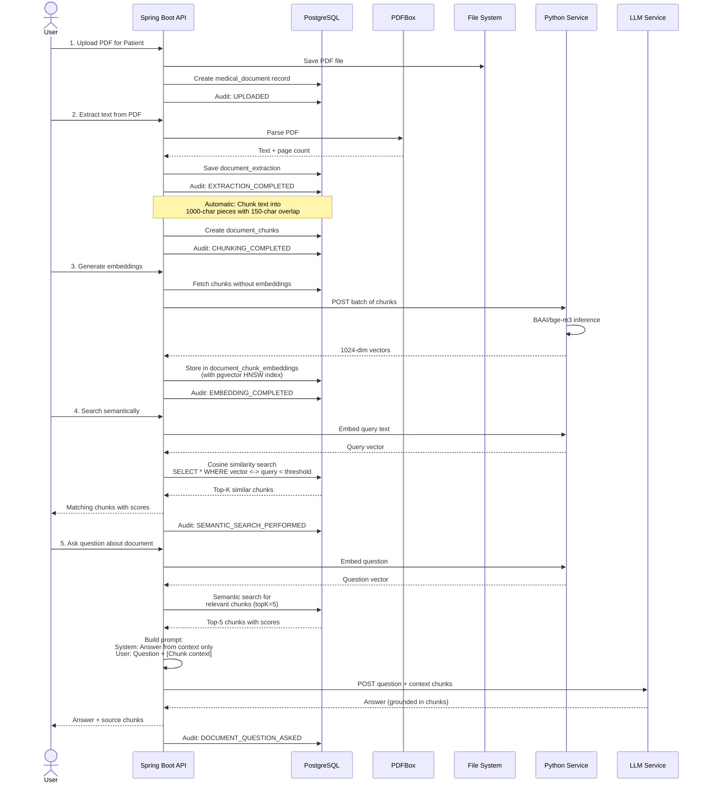
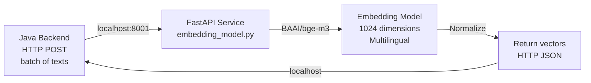
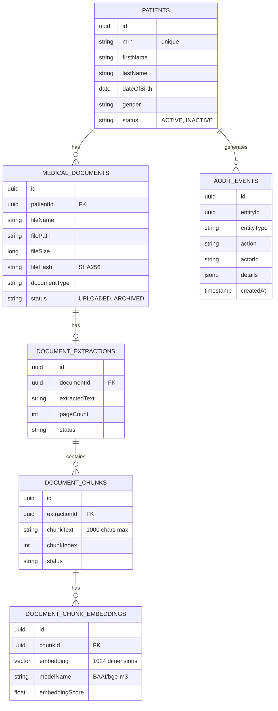

# **AI_MediDoc_Assist: Complete Project Overview**

## **What is this project?**

**AI_MediDoc_Assist** is a **healthcare document intelligence platform** that solves the problem of managing unstructured medical documents. Think of it as a "smart document reader" that can:

1. **Store** medical documents (PDFs) securely linked to patients
2. **Extract** text from PDFs automatically
3. **Understand** document content semantically (not just keyword matching)
4. **Answer questions** about documents using AI (RAG - Retrieval-Augmented Generation)
5. **Audit everything** for compliance and security

It's designed for healthcare organizations to digitize and make searchable their paper-based or PDF medical records.

---

## **System Architecture Diagram**

---

## **Data Processing Pipeline (How It Works End-to-End)**

---

## **Core Modules Explained**

### **1. Patient Module**
- **What it does**: Manages patient records (demographics, MRN, status)
- **Database**: `patients` table
- **Example**: Tracks John Doe, MRN=ABC123, Active patient

---

### **2. Document Module**
- **What it does**: Stores medical document metadata and file references
- **Storage**: Actual PDFs stored on disk (`./storage/documents`)
- **Database**: `medical_documents` table with:
  - File path, size, SHA256 checksum (for integrity)
  - Document type (LAB_REPORT, DISCHARGE_SUMMARY, etc.)
  - Status (UPLOADED, ARCHIVED)
  - Link to patient
- **Example**: Chest X-ray report PDF linked to John Doe's patient record

---

### **3. Document Extraction Module**
- **What it does**: Converts PDF files → readable text
- **Tool**: Apache PDFBox library
- **Process**: 
  1. Reads PDF file from disk
  2. Extracts all text and page count
  3. Saves text to database
- **Database**: `document_extractions` table
- **Example**: "Findings: No acute cardiopulmonary abnormality..." extracted from the chest X-ray report

---

### **4. Document Chunk Module**
- **What it does**: Breaks large text into **overlapping pieces** suitable for embedding
- **Chunking Strategy**:
  - Max chunk size: **1000 characters**
  - Overlap: **150 characters** (so chunks aren't completely independent)
  - This prevents losing context at chunk boundaries
- **Example**: If extraction is 5000 chars, it creates 5+ chunks, each with 150-char overlap
- **Database**: `document_chunks` table

---

### **5. Document Embedding Module**
- **What it does**: Converts text chunks into **vector representations** (embeddings)
- **Model**: **BAAI/bge-m3** (multilingual, 1024-dimensional)
- **Process**:
  1. Takes chunks from database
  2. Sends them to Python FastAPI service
  3. Receives back 1024-dimensional vectors
  4. Stores vectors in PostgreSQL using **pgvector** extension
- **Why vectors?**: Enables semantic search - finding chunks by **meaning**, not just keywords
- **Example**: Chunk "No acute abnormality" becomes vector [0.12, -0.45, 0.89, ...] (1024 numbers)
- **Database**: `document_chunk_embeddings` table with HNSW index for fast similarity search

---

### **6. Document Semantic Search Module**
- **What it does**: Finds relevant chunks by **semantic similarity**
- **How it works**:
  1. User searches: "Is there anything abnormal?"
  2. System embeds the query → vector
  3. Uses **pgvector cosine similarity** to find closest chunk vectors
  4. Returns matching chunks ranked by similarity score
- **Why better than keyword search?**: "No abnormality found" matches "Is there anything abnormal?" even though keywords differ

---

### **7. Document Q&A Module (RAG)**
- **What it does**: **Retrieves** relevant document chunks + **Generates** AI answers using them (RAG = Retrieval-Augmented Generation)
- **Process**:
  1. User asks: "What are the findings?"
  2. System embeds question
  3. Retrieves top-5 most similar chunks
  4. Constructs prompt: "Answer this based ONLY on: [chunks]"
  5. Sends to LLM (GPT/Claude)
  6. LLM answers grounded in document context
- **Safety**: System prompt prevents hallucination - "Only answer from given chunks, say 'not found' if unsure"
- **Citations**: Answer includes which chunks it used

---

### **8. Audit Module**
- **What it does**: Records **every operation** for compliance and debugging
- **Tracked events**:
  - Documents: UPLOADED, DOWNLOADED, ARCHIVED
  - Extraction: STARTED, COMPLETED, FAILED
  - Embedding: STARTED, COMPLETED, FAILED
  - Search: SEMANTIC_SEARCH_PERFORMED
  - QA: DOCUMENT_QUESTION_ASKED
- **Database**: `audit_events` table with JSON details
- **Purpose**: HIPAA compliance, debugging, user attribution

---

## **Python Embedding Service**

**Key Points**:
- Runs on **port 8001** as separate Python process
- Uses **BAAI/bge-m3** model (multilingual, 1024-dimensional)
- Processes **batch of up to 32 chunks** at once (efficient)
- Supports GPU (CUDA), Apple Silicon (MPS), and CPU
- Returns **L2-normalized vectors** (standard for cosine similarity)

---

## **Database Schema (Relationships)**

---

## **Real-World Workflow Example**

Let's say **Dr. Smith uploads John Doe's chest X-ray report**:

1. **Upload** (Document Module)
   - Uploads PDF to backend
   - System stores at `./storage/documents/[uuid].pdf`
   - Creates record: patient=John Doe, type=LAB_REPORT
   - ✅ Audit logged: UPLOADED

2. **Extract** (Extraction Module)
   - PDFBox reads PDF
   - Extracts text: "CHEST X-RAY REPORT. Findings: No acute cardiopulmonary abnormality. Heart size normal..."
   - Saves to database (3 pages)
   - ✅ Audit logged: EXTRACTION_COMPLETED

3. **Chunk** (Chunking Module)
   - Breaks text into ~3 chunks of 1000 chars with 150-char overlap
   - Chunk 1: "CHEST X-RAY REPORT. Findings: No acute cardiopulmonary abnormality. Heart size normal. Lungs clear..."
   - Chunk 2: "...Heart size normal. Lungs clear. No focal consolidations. No pleural effusion. Mediastinum normal..."
   - Chunk 3: "...No pleural effusion. Mediastinum normal. IMPRESSION: Normal chest X-ray."
   - ✅ Audit logged: CHUNKING_COMPLETED

4. **Embed** (Embedding Module)
   - Sends 3 chunks to Python service
   - Receives back 3 vectors (each 1024 numbers)
   - Stores in database with HNSW index
   - ✅ Audit logged: EMBEDDING_COMPLETED

5. **Search** (Semantic Search)
   - Dr. Johnson searches: "Any lung problems?"
   - System embeds query → vector
   - Cosine similarity finds: Chunk 2 (0.87 similarity)
   - Returns: "...Lungs clear. No focal consolidations..."
   - ✅ Audit logged: SEMANTIC_SEARCH_PERFORMED

6. **Ask Question** (RAG)
   - Dr. Johnson asks: "Is there any abnormality?"
   - System retrieves top chunks: "No acute cardiopulmonary abnormality...", "Normal chest X-ray"
   - Constructs prompt: "Based on: [chunks], answer: Is there any abnormality?"
   - LLM responds: "No, the report indicates normal findings with no acute abnormalities detected."
   - Response includes source chunks
   - ✅ Audit logged: DOCUMENT_QUESTION_ASKED

---

## **Technology Stack Summary**

| Layer | Technology | Purpose |
|-------|-----------|---------|
| **API** | Spring Boot 3.5 + Spring Web | REST endpoints, routing |
| **Language** | Java 21 | Type-safe, production-ready |
| **ORM** | Hibernate (Spring Data JPA) | Object-database mapping |
| **Database** | PostgreSQL 16 + pgvector | Relational data + vector search |
| **PDF Processing** | Apache PDFBox 3.0 | Extract text from PDFs |
| **Migrations** | Flyway | Database versioning |
| **Embedding Service** | Python FastAPI | Separate service for AI inference |
| **Embedding Model** | BAAI/bge-m3 | 1024-dim multilingual embeddings |
| **Vector Math** | PyTorch + NumPy | Matrix operations, normalization |
| **API Docs** | Swagger/OpenAPI | Interactive API documentation |
| **Container** | Docker Compose | Local PostgreSQL + pgvector |

---

## **Key Design Decisions**

1. **Separate Embedding Service**: Python service handles AI inference, decoupled from Java backend
2. **pgvector HNSW Index**: Fast similarity search even with millions of vectors
3. **Overlapping Chunks**: Prevents losing context between chunk boundaries
4. **Audit Everything**: Every operation logged for compliance (healthcare requirement)
5. **Batch Processing**: Embeddings generated in batches of up to 32 for efficiency
6. **Immutable Vectors**: Once embedded, chunks don't change (idempotent)
7. **Grounded RAG**: LLM instructed to answer only from document context, preventing hallucinations

---

## **Summary**

AI_MediDoc_Assist is a **complete healthcare document intelligence system** that:
- ✅ Stores medical documents securely
- ✅ Extracts text from PDFs automatically
- ✅ Creates semantic vector embeddings for intelligent search
- ✅ Answers questions grounded in document content using RAG
- ✅ Maintains complete audit trail for compliance

It's built with **modern, production-ready technologies** (Java, PostgreSQL, pgvector, Python AI models) and follows **clean architecture patterns** (layered design, separation of concerns, audit logging).